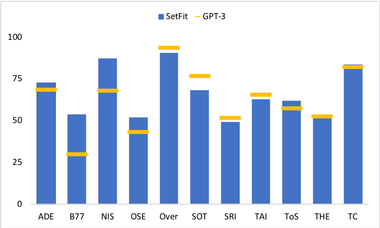

# Outperform OpenAI GPT-3 for classifiation with SetFit

In many Machine Learning applications, the amount of available labeled data is a barrier to producing a high-performing model. 
In the last 2 years developments have shown that you can overcome this data limitation by using Large Language Models, like [OpenAI GPT-3](https://openai.com/blog/gpt-3-apps/) together wit a *few* examples as prompts at inference time to achieve good results. These developments are improving the missing labeled data situation but are introducing a new problem, which is the access and cost of Large Language Models. 

But a group of research led by [Intel Labs](https://www.intel.com/content/www/us/en/research/overview.html) and the [UKP Lab](https://www.informatik.tu-darmstadt.de/ukp/ukp_home/index.en.jsp), [Hugging Face](https://huggingface.co/) released an new approach, called "SetFit" (https://arxiv.org/abs/2209.11055), that can be used to create high accuracte text-classification models with limited labeled data. 
SetFit is outperforming GPT-3 in 7 out of 11 tasks, while being 1600x smaller. 

---

In this blog, you will learn how to use [SetFit](https://github.com/huggingface/setfit) to create a text-classification model with only a 8 labeled data examples. You will also learn how to improve your model by using hyperparamter tuning. 

You will learn how to:

1. [Setup Development Environment](#1-setup-development-environment)
2. [Create Dataset](#2-load-and-prepare-funsd-dataset)
3. [Fine-Tune Classifier with SetFit](#3-fine-tune-and-evaluate-layoutlm)
4. [Use Hyperparameter search to optimize results](#4-run-inference-and-parse-form)

## Why SetFit is better

Compared to other few-shot learning methods, SetFit has several unique features:

🗣 No prompts or verbalisers: Current techniques for few-shot fine-tuning require handcrafted prompts. SetFit dispenses with prompts altogether by generating rich embeddings directly from text examples.
🏎 Fast to train: SetFit doesn't require large-scale models like T0 or GPT-3 to achieve high accuracy.
🌎 Multilingual support: SetFit can be used with any Sentence Transformer on the Hub.

---

Now we know why SetFit is amazing, let's get started. 🚀

_Note: This tutorial was created and run on a g4dn.xlarge AWS EC2 Instance including a NVIDIA T4._
